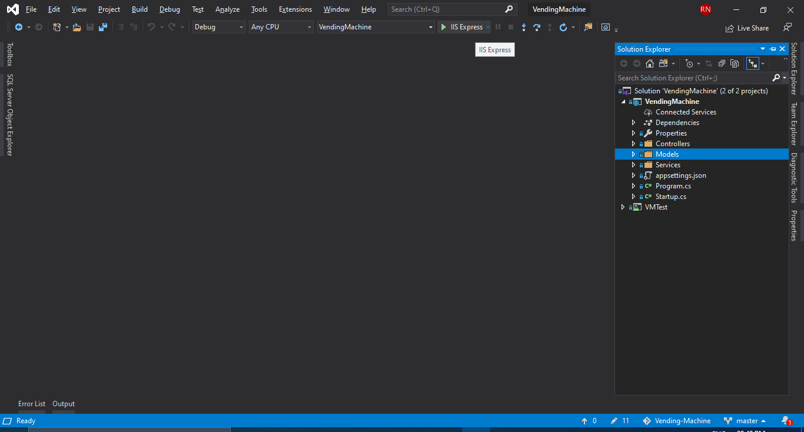
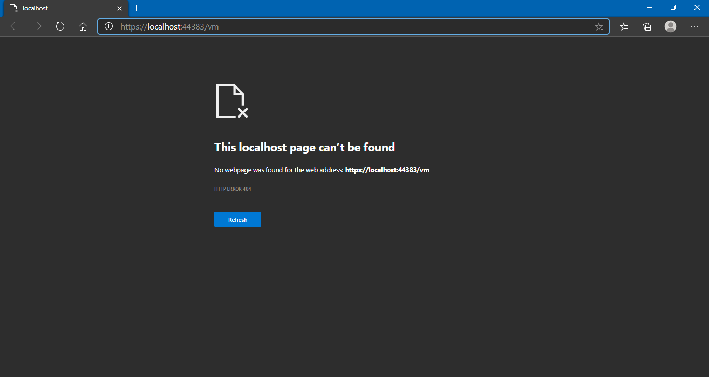
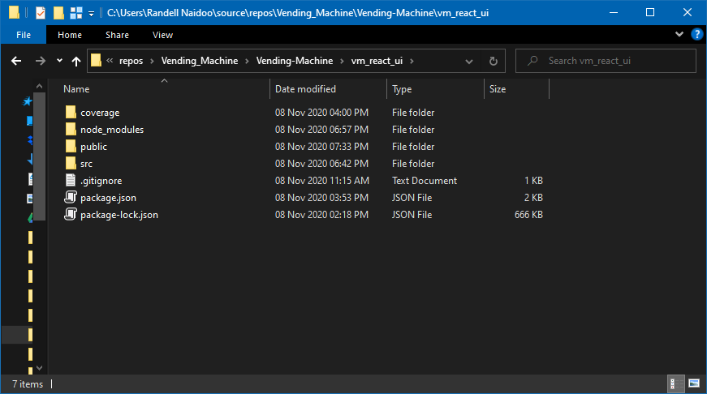
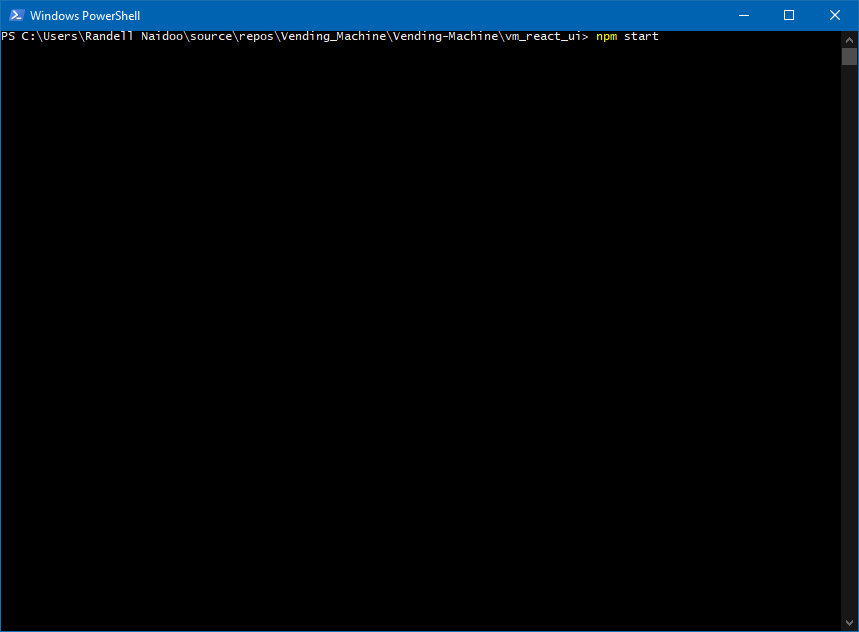
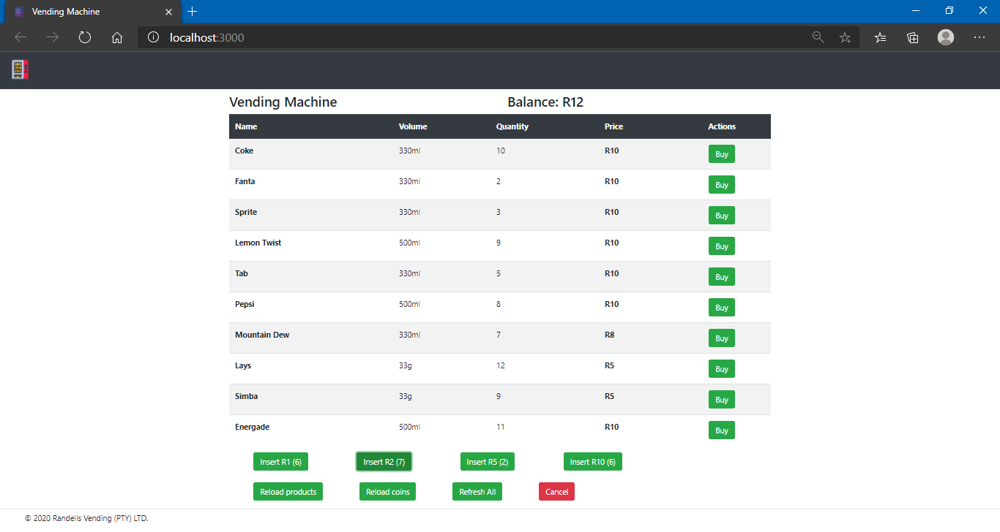
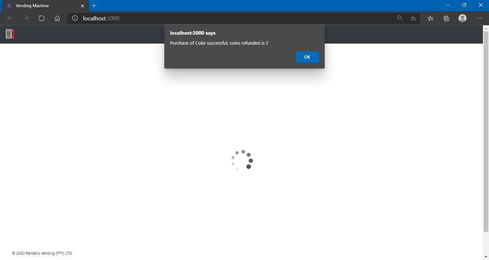
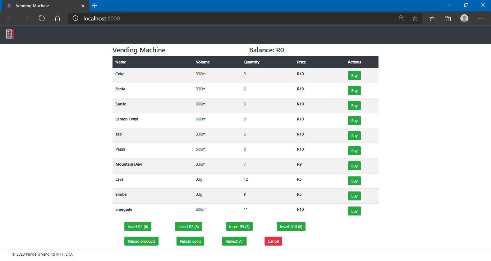

# Vending Machine WebApp
React SPA that consumes an ASP.net Core Web API Service

# Direction of use
- React project will require you to run an npm install, inside the root directory, and then you can run npm start to open up the WebApp
- Web API Service, will require Visual Studio(2019 was used to create it). Wait for all necessary NuGet Packages to install, and then click play through IIS Express

# Running Web API

- Once you up the API Service in Visual Studio, and all the packages are restored. Click on IIS Express, to run the service

- When the API runs, it will open up in your broswer as seen below, do not worry about it not finding anything, as it will not be pointing to any end points at the moment. If you want to test the API in browser, you may add the Products endpoint to the URL, example: https://localhost:44383/vm/products.

- Your API Service will now continue to run as long as the browser page is kept open.

# Running React SPA

- To run the React SPA, you will need to open up the "vm_react_ui" folder.

- You will then run your command prompt as an administrator in this folder, and perform an npm install.

- After successfully completed the npm install, you can now run the Web App, by running the "npm start" command in the terminal.

# Screenshots
- When the WebApp opens, and the Service is up and running, you will see this home page.

- You will need to click on insert coins, any of your choice, and you will see the balance available for use of buying products go up. 

- Now select on Buy, at whichever product you choose. The system will tell you if your purchase was successful, and return your change. 

- You will notice that after a successful purchase, the product quantity of the item bought, decreases. 

